- [Chinese](README_ch.md)
- [English](README.md)

# TriPham Build Guide
## Build ZMK firmware instructions
  1. Clone this repository
  2. Create the `zmk-config` directory on the same level as `zmk-new_corne`
  3. `cd` to `zmk-config` directory and create a soft link to `zmk-new_corne/config` directory:
      ```
      cd zmk-config
      ln -s ../zmk-new_corne/config/ .
      ```
  4. Initialize zmk source dir inside `zmk-config`:
     ```
     cd zmk-config
     west init -l "$(pwd)/config"
     west update
     ```
  5. Build the zmk firmware inside `zmk-config`:
     ```
     cd zmk-config
     source ../.venv/bin/activate

     echo "Export zephyr"
     west zephyr-export
     
     echo "Build nice_view - eyelash_corne_left"
     west build -s zmk/app -d "$(pwd)/build/left" -b "eyelash_corne_left"  -- -DZMK_CONFIG="$(pwd)/config" -DSHIELD="nice_view" -DZMK_EXTRA_MODULES="$(pwd)/../zmk-new_corne"
     
     echo "Build nice_view - eyelash_corne_right"
     west build -s zmk/app -d "$(pwd)/build/right" -b "eyelash_corne_right"  -- -DZMK_CONFIG="$(pwd)/config" -DSHIELD="nice_view" -DZMK_EXTRA_MODULES="$(pwd)/../zmk-new_corne"
     ```


# 睫毛外设 (Eyelash Peripherals) Corne ZMK Repository

**This keyboard is not the same as [foostan's Corne](https://github.com/foostan/crkbd). It will not work with standard `corne` firmware.**


If you need a 3D model of this keyboard, email `380465425@qq.com`.

## Instructions

1. [Fork this repository](https://docs.github.com/en/get-started/quickstart/fork-a-repo#forking-a-repository).
2. [Click the **Actions** tab and make sure the workflow is enabled](https://docs.github.com/en/actions/managing-workflow-runs-and-deployments/managing-workflow-runs/disabling-and-enabling-a-workflow#enabling-a-workflow).
3. Make sure the `eyelash_corne` project in [`config/west.yml`](config/west.yml) still works. The `boards/arm/eyelash_corne` folder will be downloaded from this URL.
4. If there is still a `boards/arm/eyelash_corne` folder in your fork, delete it.

**If you already have a ZMK config repository, [you can add this one as a module instead of forking](https://zmk.dev/docs/features/modules#building-with-modules).**

## Keymap Diagram



